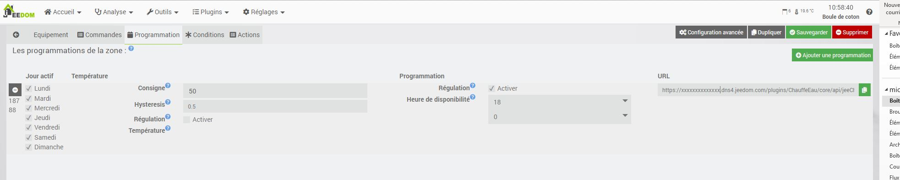
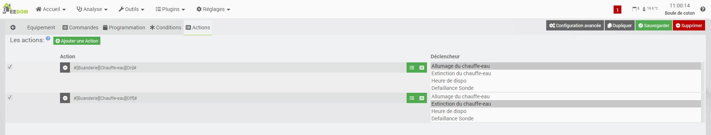

Description
==========

Ce plugin permet de gérer votre chauffe-eau.
Il va estimer le temps nécessaire pour une chauffe complète de votre ballon.
Si votre installation est equipé d'une sonde de température, le plugin stopera la chauffe des qu'il attendra sa température désiré.
Aprés l'heure programmée, le plugin stopera le chauffage et attendera le prochain crénaux reduit du temps de chauffage calculé.

Paramètrage du plugin
==========  

   

Sur ce blog, vous aurrez l'exemple d'une installation complete de la gestion de chauffe eau avec jeedom
https://jeedom-facile.fr/index.php/2019/01/03/piloter-votre-ballon-deau-chaude/

Parametre général
---

* Nom  : le nom a déjà été paramétré, mais vous avez la possibilité de le changer.      
* Objet parent : ce paramètre permet d'ajouter l'équipement dans un objet Jeedom.       
* Catégorie : déclare l'équipement dans une catégorie.      
* Visible : permet de rendre l'équipement visible dans le Dashboard.        
* Activer : permet d'activer l'équipement.      

Parametre du chauffe eaux
---

* Capacité du chauffe-eau (Litre) : indiquez le volume de votre chauffe-eau
* Puissance du chauffe-eau (Watt) : indiquez la puissance de votre chauffe-eau, cette puissance sera révalué en cours d'utilisation
* Température Souhaitée (°C) : indiquez la température à atteindre, ou saisiez une formule
* Sélectionnez une commande ou estimez la température actuelle de l'eau : indiquez la température au moment de la chauffe ou choisissez un objet Jeedom représentant la valeur, ou saisiez une formule

Controle du chauffe eau
---
* Répéter les commandes d'allumage et d'extinction : Permet donc configurer une recurence d'emission des ordres de commande et de s'assurer que le chauffe eau est toujours dans l'etat attendue
* Commande d'etat du chauffe-eau : sélectionnez la commande d'etat de votre chauffe-eau afin de permetre au plugin de se mettre a jours > La commande de retour d'etat doit etre d'un sous-type binaire (0 => Eteint, 1 => Allumée)
* Temps additionnel (min) : Ce temps définie en minute permet d'ajouté eu temps calculé un temps de sécurité au demarrage
* Si délestage, le chauffe-eau doit : Choix du comportement que doit avoir le plugin en cas de delestage durant la chauffe

Programmation
==========
Nous avans la possibilité de cree plusieurs programmation  de notre chauffe eau, en fonction des jours de la semaine, de l'heure de disponibilité de l'eau chaude ou d'un seuil de température. 
  

Programmation hystérésis
---

Lorsque vous sélectionnez une programmation par seuil, vous allez créer une regulation par Hystérésis, la mise en route de votre chauffage se produit dès que la température est inférieure au seuil et il s’éteint dès que la température dépasse la consigne .

### Principe du mode hystérésis

Par exemple, si on règle l’hystérésis à 1°C et que la valeur de consigne vaut 19°C, alors le chauffage s’active lorsque la température passe en dessous de 18°C et s’arrête dès qu’il atteint 20°C.

 

Programmation Horaire
---
Lorsque vous sélectionnez une programmation horaire, le chauffage de l'eau sera autorisé uniquement dans la plage horaire :
Heure Programmé - Temps de chauffe > Chauffe > Heure Programmé.

Programmation dynamique
---

Pour chaque programmation une url de reconfiguration est disponible pour le liée avec d'autre equipement.
L'url de reprogrammation se presente sous la forme
URL_Jeedom/plugins/ChauffeEau/core/api/jeeChauffeEau.php?apikey=APIKEY&id=ID&prog=IDcmd&day=%DAY&heure=%H&minute=%M&seuil=%S
Les champs "URL_Jeedom, APIKEY, ID, IDcmd sont automatiquement complété pour chaque URL.
Il sera imperatif de personlaiser cette url en remplace les parametre par les informations a complété :

- %DAY : Les jours de declanchement (0 = Dimanche, 1 = Lundi, ...)
- %H : L'heure de declanchement du reveil
- %M : La minite de declanchement du reveil
- %S : Le seuil a atteindre pour délencher

Si les parametres heure=%H etminute=%M sont présent dans l'url alors le plugin activera la programmation horaire
Si le parametre seuil=%S est présent dans l'url alors le plugin activera la programmation hystérésis

Condition
==========
Afin de pouvoir filtrer les declanchements du ChauffeEau nous avons la possibilité de lui ajouté des conditions d'execution.
Par exemple je suis en vacance, je ne veux donc pas que le chauffe-eau se declanche

Cliquer sur "Ajouter une condition" et configurer votre condition
Chaque condition de la liste formera un ET

Actions
==========

Il est possible de configurer le séquencement des actions a réaliser pour chaque phases de la commande de chauffage.
Chaque action configurée sera exécutée dans l'ordre choisi.
Nous pouvons aussi bien ajouter une commande qu'un scénario

Mode de fonctionnement
==========

Le plugin a 4 mode de fonctionnement, Marche forcé, Automatique , Off ou Delestage.
Nous pouvons connaitre et controler chaqu'une de ses mode par une commande

La commande "Marche forcée" permet de forcer l'allumage du chauffe-eau.
La commande "Désactiver" permet de forcer l'extinction du chauffe-eau.
La commande "Automatique" permet de laisser le plugin gerer le chauffe-eau.
La commande "Délestage" permet de forcer l'extinction du chauffe-eau mais en ayant la possibilté de prolongé la chauffe.

> En fonction de l'etat du chauffe-eau vu par le plugin et l'etat reel, le plugin changera automatiquement le mode.
Par exemple, vous forcé l'allumage du chauffe-eau en manuel, le retour d'etat reel passe a on alors que le plugin attend un off, il comprend alors que nous souhaitons faire un marche forcé et passe par se mode pour ne pas interfer dans votre decision manuel
