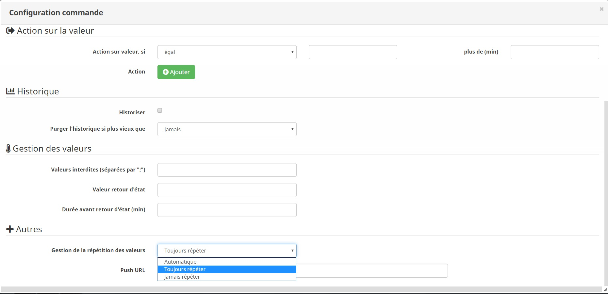

Description
==========

Ce plugin permet de gérer votre chauffe-eau.
Il va estimer le temps nécessaire pour une chauffe complète de votre ballon.
Si votre installation est equipé d'une sonde de température, le plugin stopera la chauffe des qu'il attendra sa température désiré.
Aprés l'heure programmée, le plugin stopera le chauffage et attendera le prochain crénaux reduit du temps de chauffage calculé.

Le plugin embarque une regulation configurable par hystérésis

### Principe du mode hystérésis

Par exemple, si on règle l’hystérésis à 1°C et que la valeur de consigne vaut 19°C, alors le chauffage s’active lorsque la température passe en dessous de 18°C et s’arrête dès qu’il atteint 20°C.

	

Paramètrage du plugin
==========	

	

Sur ce blog, vous aurrez l'exemple d'une installation complete de la gestion de chauffe eau avec jeedom
https://jeedom-facile.fr/index.php/2019/01/03/piloter-votre-ballon-deau-chaude/

Parametre général
---

* Nom  : le nom a déjà été paramétré, mais vous avez la possibilité de le changer.		
* Objet parent : ce paramètre permet d'ajouter l'équipement dans un objet Jeedom.		
* Catégorie : déclare l'équipement dans une catégorie.		
* Visible : permet de rendre l'équipement visible dans le Dashboard.		
* Activer : permet d'activer l'équipement.		

Parametre du chauffe-eau
---

* Capacité du chauffe-eau (Litre) : indiquez le volume de votre chauffe-eau
* Puissance du chauffe-eau (Watt) : indiquez la puissance de votre chauffe-eau, cette puissance sera révalué en cours d'utilisation
* Température Souhaitée (°C) : indiquez la température à atteindre, ou saisiez une formule
* Simuler la temperature du balon : Si actif alors le plugin simulera une perte de temperature de votre ballon
* Sélectionner une commande de la température actuelle de l'eau : Choisissez un objet Jeedom représentant la valeur
* Température de la piece : Temperature de la piece du balon (valeur mini de la simulation de temperature)

Controle du chauffe-eau
---

* Protection Bacteriologique : ce mode si actif permet au plugin de lancé automatiquement un nettoyage bacteriologique
* Temps de protection : Defini le temps que le ballon reste en zonne critique (25°C > 47°C)
* Répéter les commandes d'allumage et d'extinction : Permet donc configurer une recurence d'emission des ordres de commande et de s'assurer que le chauffe eau est toujours dans l'etat attendue
* Commande d'etat du chauffe-eau : sélectionnez la commande d'etat de votre chauffe-eau afin de permetre au plugin de se mettre a jours > La commande de retour d'etat doit etre d'un sous-type binaire (0 => Eteint, 1 => Allumée)
* Temps additionnel (min) : Ce temps définie en minute permet d'ajouté eu temps calculé un temps de sécurité au demarrage
* Si délestage, le chauffe-eau doit : Choix du comportement que doit avoir le plugin en cas de delestage durant la chauffe

Si vous utilisé une sonde de température reel, le plugin enregistre les caracteristiques de perte.
Il est possible de visualiser cette caracteristique en cliquant sur le bouton "Caracterisitique"

Programmation
==========
Nous avans la possibilité de cree plusieurs programmation de notre chauffe eau, en fonction des jours de la semaine, de l'heure de disponibilité de l'eau chaude ou d'un seuil de température. 
	

Pour chaque programmation, nous pouvons determiner, une consigne, l'hystérésis, et le type de regulation active avec ses paramtres.

Programmation déclanché par Température
---

Si la regulation par Température est actif alors le plugin cherchera l'heure d'atteinte de la valeur de seui et se declanchera uniquement en dessous de cette valeur.

Programmation Horaire
---
Lorsque vous sélectionnez une programmation horaire, le chauffage de l'eau sera autorisé uniquement dans la plage horaire :
Heure Programmé - Temps de chauffe > Chauffe > Heure Programmé.

Programmation dynamique
---

Pour chaque programmation une url de reconfiguration est disponible pour le liée avec d'autre equipement.
L'url de reprogrammation se presente sous la forme
URL_Jeedom/plugins/ChauffeEau/core/api/jeeChauffeEau.php?apikey=APIKEY&id=ID&prog=IDcmd&day=%DAY&heure=%H&minute=%M&seuil=%S
Les champs "URL_Jeedom, APIKEY, ID, IDcmd sont automatiquement complété pour chaque URL.
Il sera imperatif de personlaiser cette url en remplace les parametre par les informations a complété :

- %DAY : Les jours de declanchement (0 = Dimanche, 1 = Lundi, ...)
- %H : L'heure de declanchement du reveil
- %M : La minite de declanchement du reveil
- %S : Le seuil a atteindre pour délencher

Si les parametres heure=%H etminute=%M sont présent dans l'url alors le plugin activera la programmation horaire
Si le parametre seuil=%S est présent dans l'url alors le plugin activera la programmation hystérésis

Condition
==========
Afin de pouvoir filtrer les declanchements du ChauffeEau nous avons la possibilité de lui ajouté des conditions d'execution.
Par exemple je suis en vacance, je ne veux donc pas que le chauffe-eau se declanche

Cliquer sur "Ajouter une condition" et configurer votre condition
Chaque condition de la liste formera un ET

Actions
==========

Les actions sont executé dans l'ordre d'apparition en fonction de leur declancheurs.
Il existe 3 declanchement
* Allumage du chauffe-eau : Toutes les actions que l'on souhaite lorsque le plugin ordonera un allumage
* Extinction du chauffe-eau : Toutes les actions que l'on souhaite lorsque le plugin ordonera une extinction
* Heure de dispo : Toutes les actions que l'on souhaite lorsque le plugin mettera fin a son cycle
* Defaillance Sonde : Si vous utilisé un sonde de température, le plugin vas la surveiller et exceuter ce type d'action pour corriger ou notifier.

Mode de fonctionnement
==========

Le plugin a 4 mode de fonctionnement, Marche forcé, Automatique , Off ou Delestage.
Nous pouvons connaitre et controler chaqu'une de ses mode par une commande

La commande "Marche forcée" permet de forcer l'allumage du chauffe-eau.
La commande "Désactiver" permet de forcer l'extinction du chauffe-eau.
La commande "Automatique" permet de laisser le plugin gerer le chauffe-eau.
La commande "Délestage" permet de forcer l'extinction du chauffe-eau mais en ayant la possibilté de prolongé la chauffe.

> En fonction de l'etat du chauffe-eau vu par le plugin et l'etat reel, le plugin changera automatiquement le mode.
Par exemple, vous forcé l'allumage du chauffe-eau en manuel, le retour d'etat reel passe a on alors que le plugin attend un off, il comprend alors que nous souhaitons faire un marche forcé et passe par se mode pour ne pas interfer dans votre decision manuel

FAQ
===

Je veux que le plugin ne se déclanche qu'en heure creuse
---
> Pour cette problematique, propre a la france, il est facile d'ajouter une condition qui n'autorisera le declanchement uniquement dans la periode qui defini les heures creuse.
Tous commes pour les autres specificité tarifaire existante.

Le plugin change automatiquement de mode de fonctionnement
---
> Le changement automatique de gestion se fait sur l'incoherance de l'etat reel et l'etat de pilotage du plugin.
Se mode automatique est important pour qu'une manipulation manuel ou scenario soit prioritaire.
Dans une premier temps, il faut s'assurer qu'aucune action exterieur au plugin soit faite.
Dans un second temps il faut verifier la synchronisation des etats.
L'etat reel doit etre identique a l'etat de pilotage. Si ce n'est pas le cas il faut verifier la  *répétition de votre commande d'état*.
Pour le corriger, rendez-vous sur la page de configuration du plugin de contrôle de votre module et double-cliquez sur la commande de retour d'état.
Jeedom va vous ouvrir la page de paramètre avancé
Allez dans l'onglet **Configuration** >> **Autres** et passez le paramètre **Gestion de la répétition des valeurs** sur **Toujours répéter**

