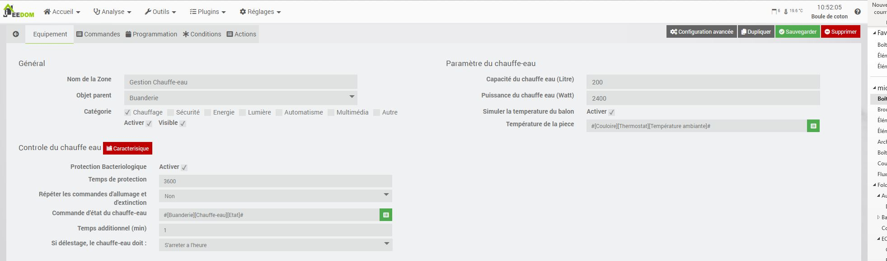
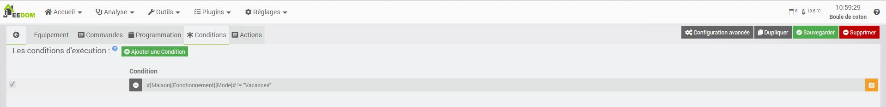

Description
==========

Ce plugin permet de gérer votre chauffe-eau.
Il va estimer le temps nécessaire pour une chauffe complète de votre ballon.
Si votre installation est equipée d'une sonde de température, le plugin stopera la chauffe dès qu'il atteindra sa température désirée.
Après l'heure programmée, le plugin stopera le chauffage et attendera le prochain crénau réduit du temps de chauffage calculé.

Le plugin embarque une régulation configurable par hystérésis

### Principe du mode hystérésis

Par exemple, si on règle l’hystérésis à 1°C et que la valeur de consigne vaut 19°C, alors le chauffage s’active lorsque la température passe en dessous de 18°C et s’arrête dès qu’il atteint 20°C.

	

Paramètrage du plugin
==========	

	

Sur ce blog, vous aurez l'exemple d'une installation complète de la gestion de chauffe-eau avec jeedom
https://jeedom-facile.fr/index.php/2019/01/03/piloter-votre-ballon-deau-chaude/

Paramètre général
---

* Nom  : le nom a déjà été paramétré, mais vous avez la possibilité de le changer.		
* Objet parent : ce paramètre permet d'ajouter l'équipement dans un objet Jeedom.		
* Catégorie : déclare l'équipement dans une catégorie.		
* Visible : permet de rendre l'équipement visible dans le Dashboard.		
* Activer : permet d'activer l'équipement.		

Paramètre du chauffe-eau
---

* Capacité du chauffe-eau (Litre) : indiquez le volume de votre chauffe-eau
* Puissance du chauffe-eau (Watt) : indiquez la puissance de votre chauffe-eau, cette puissance sera révaluée en cours d'utilisation
* Température souhaitée (°C) : indiquez la température à atteindre, ou saisissez une formule
* Simuler la température du balon : Si actif alors le plugin simulera une perte de temperature de votre ballon
* Sélectionner une commande de la température actuelle de l'eau : Choisissez un objet Jeedom représentant la valeur
* Température de la pièce : Température de la pièce du balon (valeur mini de la simulation de température)

Controle du chauffe-eau
---

* Protection Bacteriologique : ce mode si actif permet au plugin de lancer automatiquement un nettoyage bacteriologique
* Temps de protection : Défini le temps que le ballon reste en zone critique (25°C > 47°C)
* Répéter les commandes d'allumage et d'extinction : Permet donc configurer une recurence d'emission des ordres de commande et de s'assurer que le chauffe eau est toujours dans l'état attendu
* Commande d'état du chauffe-eau : sélectionnez la commande d'état de votre chauffe-eau afin de permettre au plugin de se mettre à jour > La commande de retour d'état doit être d'un sous-type binaire (0 => Eteint, 1 => Allumée)
* Temps additionnel (min) : Ce temps défini en minute permet d'ajouter au temps calculé un temps de sécurité au démarrage
* Si délestage, le chauffe-eau doit : Choix du comportement que doit avoir le plugin en cas de delestage durant la chauffe

Si vous utilisez une sonde de température réelle, le plugin enregistre les caractéristiques de perte.
Il est possible de visualiser cette caractéristique en cliquant sur le bouton "Caracterisitique"

Programmation
==========
Nous avons la possibilité de créer plusieurs programmation de notre chauffe-eau, en fonction des jours de la semaine, de l'heure de disponibilité de l'eau chaude ou d'un seuil de température. 
	

Pour chaque programmation, nous pouvons déterminer, une consigne, l'hystérésis, et le type de régulation active avec ses paramètres.

Programmation déclenchée par Température
---

Si la régulation par Température est active alors le plugin cherchera l'heure d'atteinte de la valeur de seuil et se déclenchera uniquement en dessous de cette valeur.

Programmation Horaire
---
Lorsque vous sélectionnez une programmation horaire, le chauffage de l'eau sera autorisé uniquement dans la plage horaire :
Heure Programmé - Temps de chauffe > Chauffe > Heure Programmé.

Programmation dynamique
---

Pour chaque programmation une url de reconfiguration est disponible pour le lier avec d'autre équipement.
L'url de reprogrammation se présente sous la forme
URL_Jeedom/plugins/ChauffeEau/core/api/jeeChauffeEau.php?apikey=APIKEY&id=ID&prog=IDcmd&day=%DAY&heure=%H&minute=%M&seuil=%S
Les champs "URL_Jeedom, APIKEY, ID, IDcmd sont automatiquement complété pour chaque URL.
Il sera imperatif de personlaiser cette url en remplace les paramètres par les informations à compléter :

- %DAY : Les jours de déclenchement (0 = Dimanche, 1 = Lundi, ...)
- %H : L'heure de déclenchement du réveil
- %M : La minute de déclenchement du réveil
- %S : Le seuil à atteindre pour délencher

Si les paramètres heure=%H et minute=%M sont présents dans l'url alors le plugin activera la programmation horaire
Si le paramètre seuil=%S est présent dans l'url alors le plugin activera la programmation hystérésis

Condition
==========
Afin de pouvoir filtrer les déclenchements du Chauffe-eau, nous avons la possibilité de lui ajouter des conditions d'éxecution.
Par exemple, je suis en vacances, je ne veux donc pas que le chauffe-eau se déclenche...

Cliquer sur "Ajouter une condition" et configurer votre condition
Chaque condition de la liste formera un ET

Actions
==========

Les actions sont executées dans l'ordre d'apparition en fonction de leur déclencheurs.
Il existe 3 déclenchements
* Allumage du chauffe-eau : Toutes les actions que l'on souhaite lorsque le plugin ordonera un allumage
* Extinction du chauffe-eau : Toutes les actions que l'on souhaite lorsque le plugin ordonera une extinction
* Heure de dispo : Toutes les actions que l'on souhaite lorsque le plugin mettera fin à son cycle
* Defaillance Sonde : Si vous utilisez un sonde de température, le plugin va la surveiller et éxecuter ce type d'action pour corriger ou notifier.

Mode de fonctionnement
==========

Le plugin a 4 mode de fonctionnement, Marche forcé, Automatique , Off ou Delestage.
Nous pouvons connaitre et controler chacuns de ces modes par une commande

La commande "Marche forcée" permet de forcer l'allumage du chauffe-eau.
La commande "Désactiver" permet de forcer l'extinction du chauffe-eau.
La commande "Automatique" permet de laisser le plugin gerer le chauffe-eau.
La commande "Délestage" permet de forcer l'extinction du chauffe-eau mais en ayant la possibilité de prolonger la chauffe.

> En fonction de l'état du chauffe-eau vu par le plugin et l'état réel, le plugin changera automatiquement le mode.
Par exemple, vous forcez l'allumage du chauffe-eau en manuel, le retour d'état réel passe à on alors que le plugin attend un off, il comprend alors que nous souhaitons faire une marche forcée et passe par ce mode pour ne pas interfer dans votre décision manuelle

FAQ
===

Je veux que le plugin ne se déclenche qu'en heure creuse
---
> Pour cette problématique, propre à la France, il est facile d'ajouter une condition qui n'autorisera le déclenchement uniquement dans la période qui definie les heures creuse.
Tout comme pour les autres spécificité tarifaire existante.

Le plugin change automatiquement de mode de fonctionnement
---
> Le changement automatique de gestion se fait sur l'incohérance de l'état réel et l'état de pilotage du plugin.
Ce mode automatique est important pour qu'une manipulation manuelle ou scénario soit prioritaire.
Dans un premier temps, il faut s'assurer qu'aucune action exterieur au plugin soit faite.
Dans un second temps, il faut vérifier la synchronisation des états.
L'état réel doit être identique à l'état de pilotage. Si ce n'est pas le cas, il faut vérifier la  *répétition de votre commande d'état*.
Pour le corriger, rendez-vous sur la page de configuration du plugin de contrôle de votre module et double-cliquez sur la commande de retour d'état.
Jeedom va vous ouvrir la page de paramètre avancé
Allez dans l'onglet **Configuration** >> **Autres** et passez le paramètre **Gestion de la répétition des valeurs** sur **Toujours répéter**

